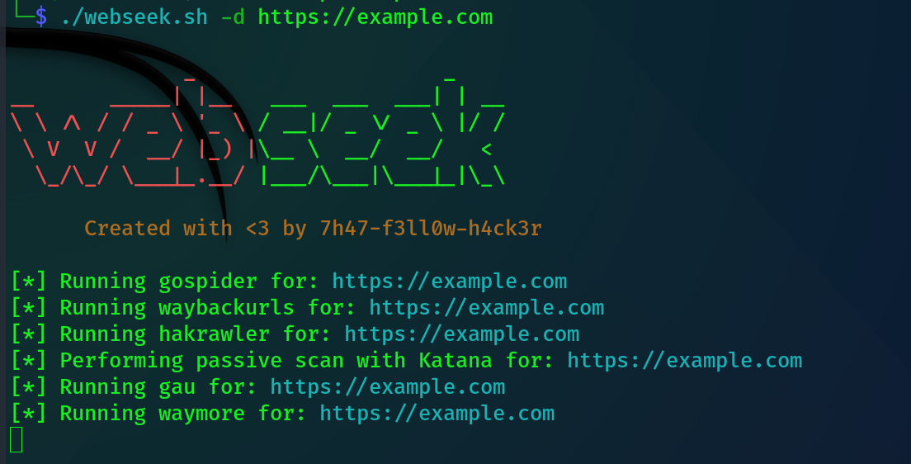

# Webseek

**webseek** is a comprehensive Bash script designed for web content discovery, automating the enumeration of URLs, parameters, and JavaScript files to aid in vulnerability identification. It integrates tools like gospider, waybackurls, hakrawler, gau, waymore, katana, paramspider, parameth, roboxtractor, and github-endpoints. The script uses unfurl to dissect URLs into components such as paths, keys, values, and JSON data, enhancing analysis. It also employs gf to search for common vulnerability patterns like XSS, SQLi, SSRF, and more, ensuring a thorough examination of potential security issues.
## Features

- **Comprehensive URL Discovery :** Aggregates URLs from various tools including gospider, waybackurls, hakrawler, gau, and katana.
- **Parameter Discovery :** Extracts and identifies URL parameters using tools like ParamSpider, Parameth, and roboxtractor.
- **JavaScript File Enumeration :** Enumerates JavaScript files using LinkFinder, subjs, and katana.
- **Unfurl URL Parsing :** Decomposes URLs into paths, keys, values, and JSON data for detailed analysis.
- **Sensitive Pattern Detection :** Searches for sensitive patterns like passwords, admin panels, and email addresses within URLs.
- **Vulnerability Pattern Search :** Uses gf to detect common vulnerability patterns such as XSS, SQLi, SSRF, and more.
- **Automated Directory Creation :** Automatically sets up directories for organizing scan results.
- **Customizable Output Directory :** Allows specification of a custom output directory for organizing results.
- **Parallel Processing :** Scans multiple domains or subdomains in parallel for efficiency.
- **Logging :** Maintains logs of scanning activities and errors for troubleshooting and record-keeping.




## Prerequisites
Ensure the following tools are installed and accessible in your system's PATH -

* **gospider -** https://github.com/jaeles-project/gospider
* **waybackurls -** https://github.com/tomnomnom/waybackurls
* **hakrawler -** https://github.com/hakluke/hakrawler
* **gau (GetAllUrls) -** https://github.com/lc/gau
* **waymore -** https://github.com/xnl-h4ck3r/waymore
* **katana -** https://github.com/projectdiscovery/katana
* **paramspider -** https://github.com/devanshbatham/ParamSpider
* **parameth -** https://github.com/maK-/parameth
* **roboxtractor -** https://github.com/yoeelingbin/roboxtractor
* **github-endpoints -** https://github.com/gwen001/github-search
* **subjs -** https://github.com/lc/subjs
* **LinkFinder -** https://github.com/GerbenJavado/LinkFinder
* **uro -** https://github.com/s0md3v/uro
* **unfurl -** https://github.com/tomnomnom/unfurl
* **gf (grep patterns) -** https://github.com/tomnomnom/gf
* **mantra -** https://github.com/0xPayne/Mantra
* **secretfinder -** https://github.com/m4ll0k/SecretFinder
## Installation


```bash
  git clone https://github.com/hackytam/webseek.git
  cd webseek
  chmod +x webseek.sh
  ./webseek.sh -h
```
    
## Usage

Run the script with appropriate options to specify the target domain or subdomains list.
```
Command Line Options :

-h, --help : Display this help message.
-d, --domain <name> : Specify a single domain name (format: https://example.com).
-sL, --subdomains-list <file> : Specify a file containing a list of subdomains.
-o, --output <directory> : Specify output directory (default: webseek).
```


## Example commands
### Run with single domain
```
./webseek.sh -d https://example.com
```
### Run with subdomain list
```
./webseek.sh -sL subdomains_list.txt 
```
### Specify output directory
```
./webseek.sh -d https://example.com -o ouput_directory    // with single domain
./webseek.sh -sL subdomains_list.txt -o ouput_directory  //with subdomain list
```
## Notes
- Ensure the provided domain starts with https://.
- Do not specify both -d and -sL options simultaneously.
- Verify the existence of the specified subdomain list file.
- Review and clean up the output directories after execution.
- **Resource Handling -** 
The webseek script is designed to perform comprehensive web content discovery and analysis using multiple tools simultaneously. However, running numerous tools in parallel can be resource-intensive and may lead to high CPU and memory usage.
If you find that the script is consuming too many system resources, consider removing the & at the end of function calls within the script. This adjustment will make the script run the tools sequentially rather than in parallel, reducing the load on your system.

For example, 

**change :**
```
run_gospider "$target" &
run_waybackurls "$target" &
run_hakrawler "$target" &
run_gau "$target" &
run_waymore "$target" &
run_katana "$target" &
```
**To :**
```
run_gospider "$target"
run_waybackurls "$target"
run_hakrawler "$target"
run_gau "$target"
run_waymore "$target"
run_katana "$target"
```

### Tip 
Avoid adding & to the run_katana_js "$target" function call. Running this function in the background may cause issues with subsequent operations such as concatenating URLs and performing other analyses on the gathered data. Ensuring this function runs sequentially helps maintain the integrity and accuracy of the data processing steps.
# License
**Webseek** is made with ♥ by **7h47-f3ll0w-h4ck3r** and it is released under the
[MIT](https://github.com/hackytam/webseek/blob/main/LICENSE) license.


## 🔗 Social Links

                                                 

<p align="center">
 Follow me on &nbsp;&nbsp;  <a href="https://www.linkedin.com/in/hackytam"></a>
  <a href="https://medium.com/@hackertam1"></a>
  <a href="https://twitter.com/hackytam"></a>
</p>

``` ```
                                                            Made with ❤️ by **@7h47-f3ll0w-h4ck3r**
